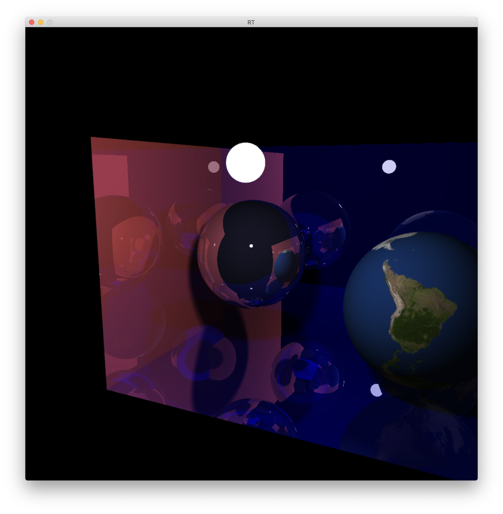
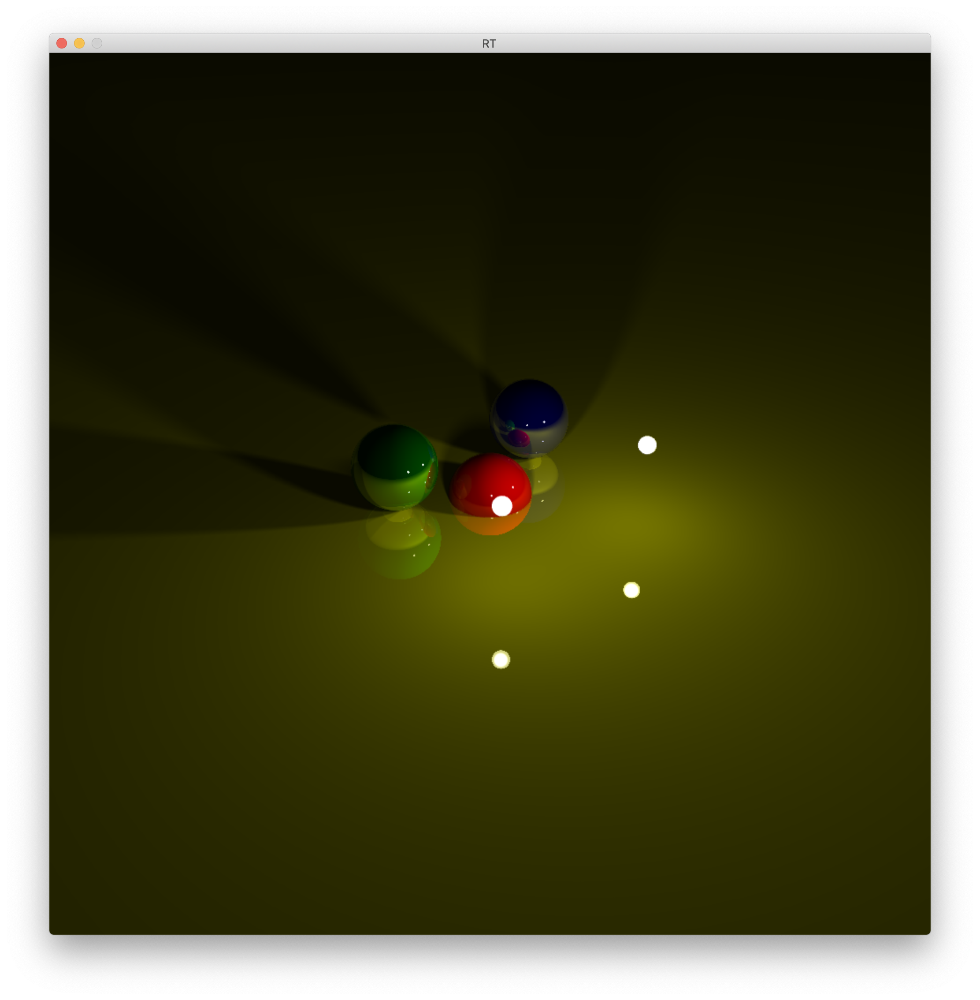
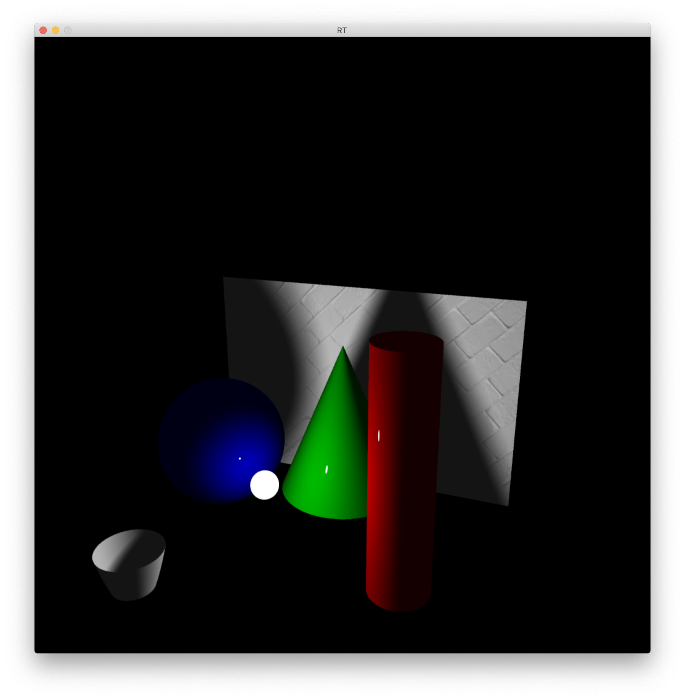
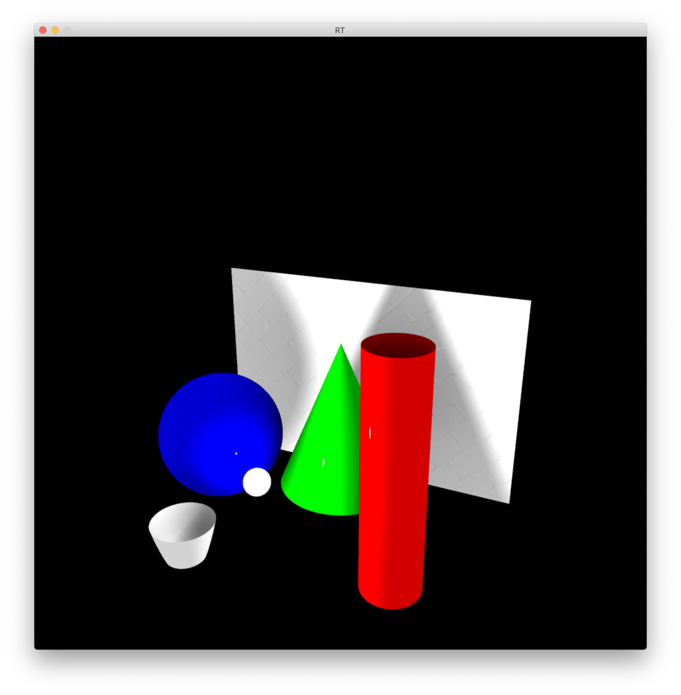
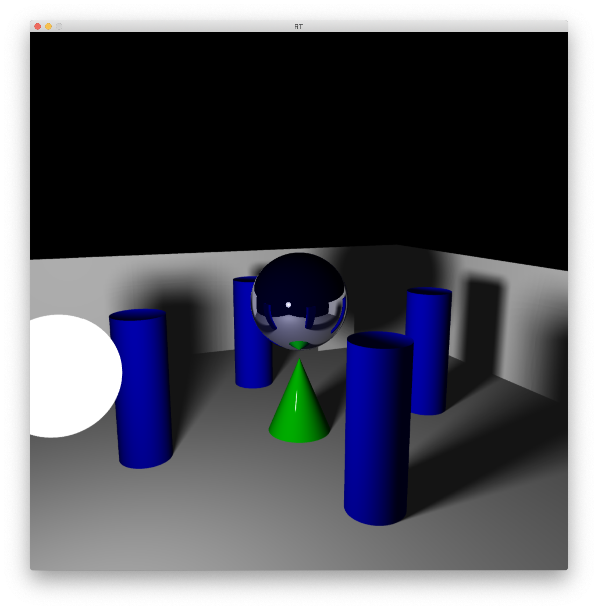
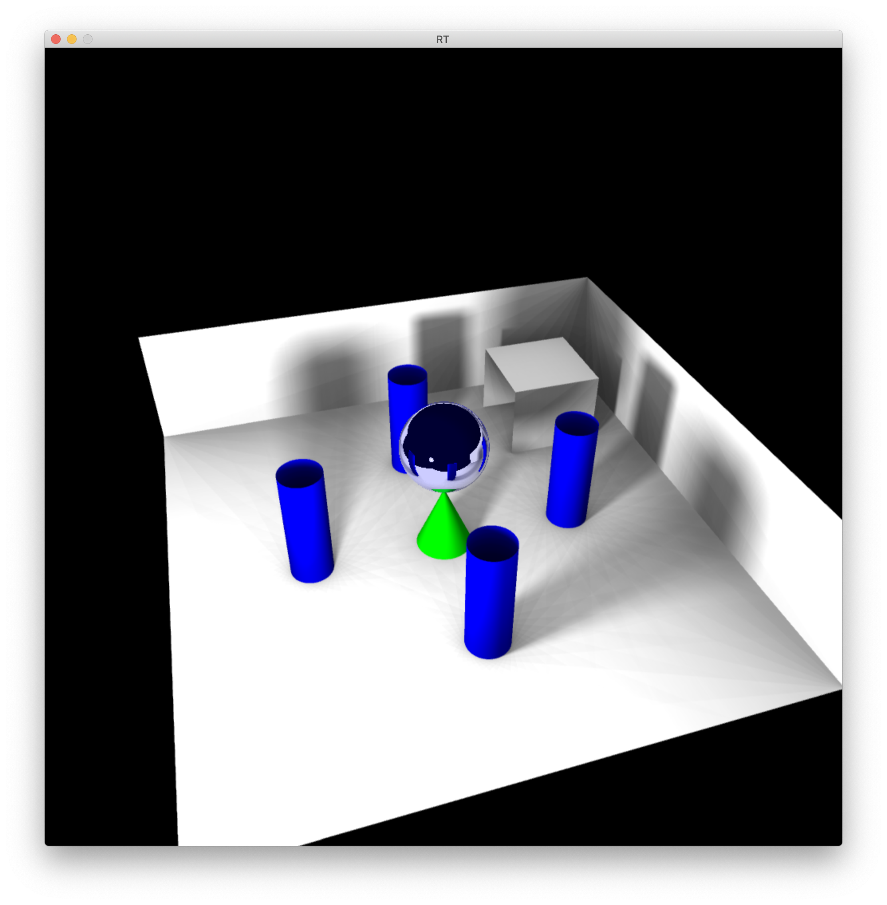

# Raytracing C/OpenCL

This project is meant to generate images according to Raytracing protocol.
Project based on SDL2 library, check whether the library is available on your system.
This version uses the **GPU** available on your system **(OpenCL)**.

## Features:
- ### Direct light
- ### Limited objects: cone, cylinder, plane, paraboloid
- ### Bump mapping and color disruption
- ### External files for scene description
- ### Reflection
- ### Transparency
- ### Soft shadows
- ### Composed elements: cubes, pyramids
- ### Textures

<figure>
    
    
</figure>

#### Ambient
<table>
  <tr>
    <td>Not active</td>
     <td>Active</td>
  </tr>
  <tr>
    <td></td>
    <td></td>
  </tr>
 </table>
 
#### Ambient
<table>
  <tr>
    <td>Not active</td>
     <td>Active</td>
  </tr>
  <tr>
    <td></td>
    <td></td>
  </tr>
 </table>
